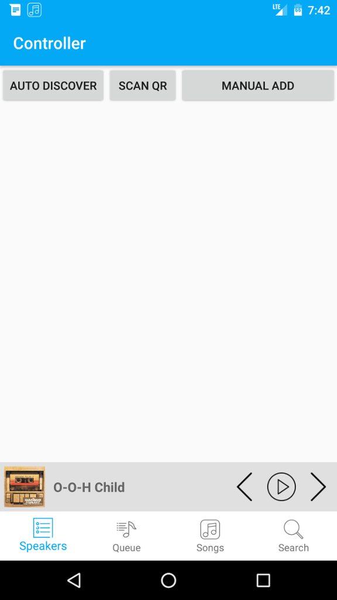
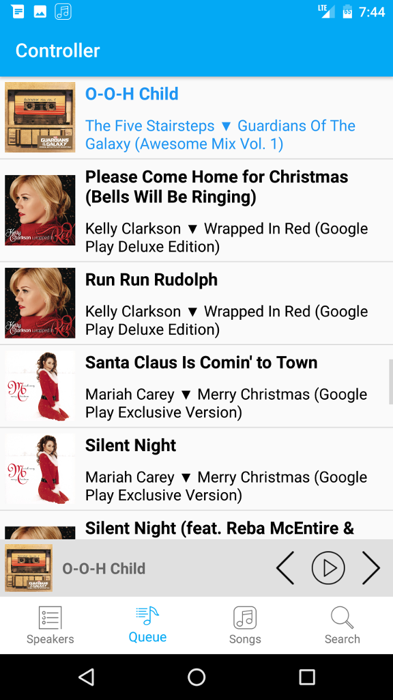
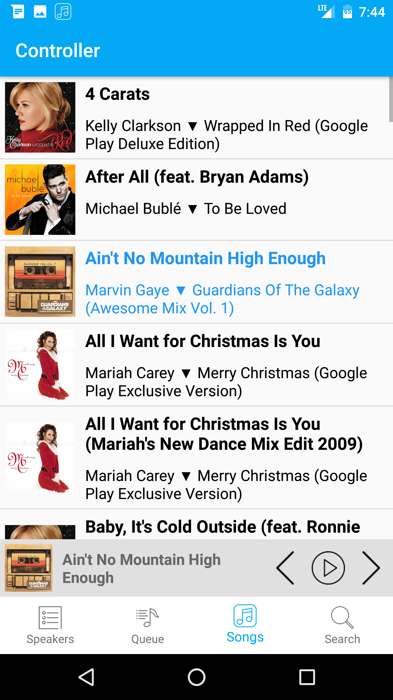
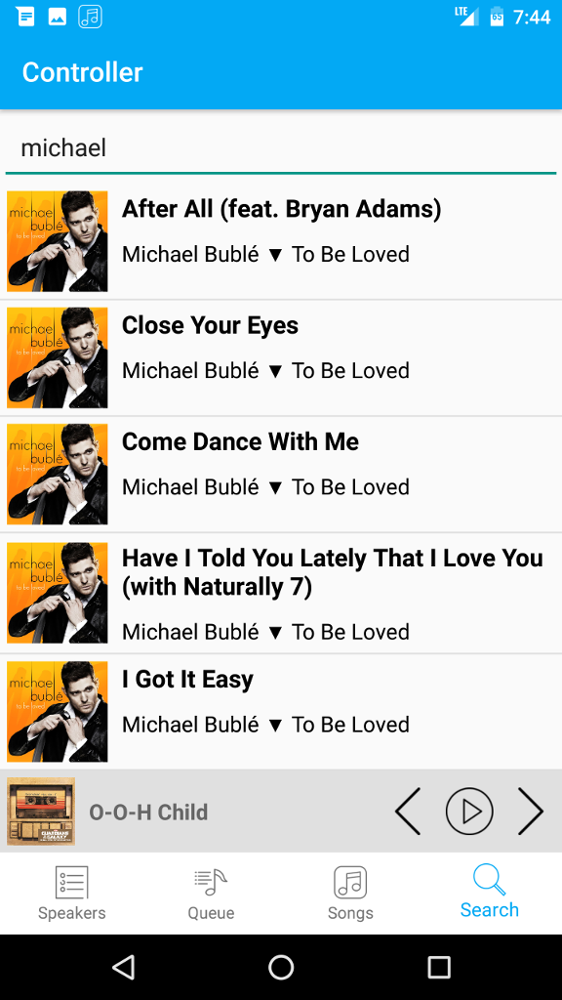
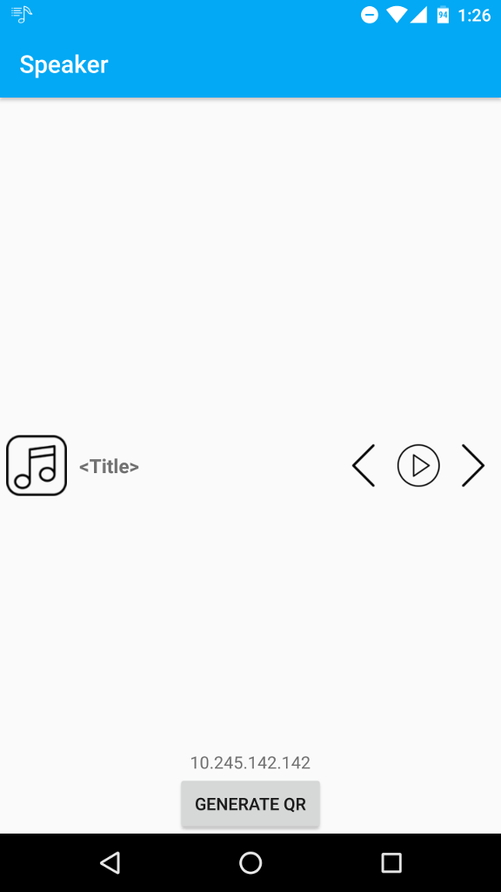
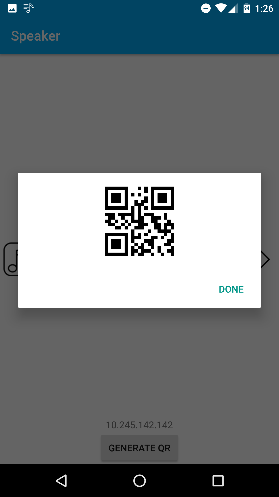
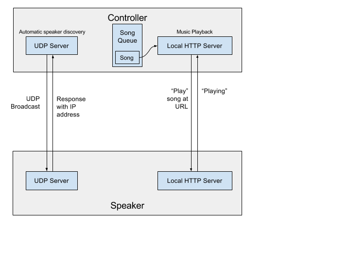

# Poor Man's Home Stereo

Poor Man’s Home Stereo enables users who cannot afford (or are too lazy to buy) a full home stereo system to still enjoy some of the experience by allowing Android phones to serve as speakers and controllers. By arranging the phones around the house, a user can have their music play in any room they wish by streaming music wirelessly from their controller to any of the speakers. Wired speakers can also be connected to the phones to play your music wirelessly. 

---------------------------------------

##Final Updates - 12/6/16
Our last two updates contained the following new features:
* **Seeking**: Both the Speaker and the Controller can now seek forward/back in a song by 15 seconds. Seeking back from the beginning of the song just restarts it, and seeking past the end of the song skips to the next song. To save space on the screen, seeking is accomplished by long-pressing on the existing back/next buttons.
* **Queue looping**: The app previously did not support looping to the start/end of the queue. It now treats the queue as a circular queue of songs.
* **Speaker volume controls**: The Controller can now change the volume of individual speakers.

We also fixed or improved the following issues:

* **Cleaner single-speaker behavior**: Music now will only play on one Speaker at a time. When switching to another Speaker, playback is stopped on all others.
* **Playback state update**: Closing the Speaker or Controller application mid-song now stops playback on the other, instead of inaccurately continuing to show the music as playing.
* **User guidance**: On initial launch, the user is now presented with an interactive walkthrough tutorial showing the basic controls and features of the app. A similar tutorial is also shown the first time the app is used in Speaker mode. When the first song is played, an additional animation is shown on the Controller to demonstrate how to use the notification controls.

---------------------------------------

## Reflection
### Kevin Liu
**What did you learn technically?**
I have had some experience with Android development and Java programming before this class, namely a few Android applications I have developed for my own use. Despite this, I have furthered my knowledge in Android APIs and learned about many development best practices from this class. For example, I have had very little experience in designing and developing an aesthetically pleasing UI that provides a smooth user experience, as I did not put much weight and effort in those areas while developing applications which I only intended for myself to use. In this class, I learned how to use the Fragments framework to effectively divide functionality into easily navigtable "chunks." Furthermore, I have also learned how to use the Android animation framework in addition to theme colors to make the UI fluid and easy on the eyes. Lastly, some things I have never had to worry about in my personal projects are internationalization and bug reporting/testing. While developing the semester project for this class, I have learned several best practices to make the application work and display correctly on devices with different screen sizes and languages in different regions of the world. Experimenting with Crashlytics, UI Monkey, and unit/instrumental tests allowed us to fix bugs before they reach the public, and also analyze and resolve bugs that are in production. 
 
**What did you learn professionally?**
I think some technical aspects that I have learned in this class also applies to development in companies and the professional world. Namely, internationalization, testing, and bug reporting are all quintessential tools that developers need to use to make sure their applications work well in the wild. These are all things I didn't need to worry about in my personal projects. Another thing I have realized is that advertising/marketing is VERY important in growing the user base. Once the users have been acquired, the next most important step is to make sure bugs are fixed as quickly as possible, as most people are quick to give 1 star reviews but slow to update their reviews after the bugs have been fixed. 

**What do you wish I could have done differently?**
One change that would help in learning Android development would be in class "work sessions" where teams get to communicate and work on the applications for most of the class period. 

**If you were to do this all over again, what would you do differently?**
I would have focused less on adding more features and more on fixing bugs and making sure existing features work well. Towards the end of this semester, there was a period of time where we were stuck with quite a few half-baked and buggy features. Building a solid foundation before moving on to adding more components would make the development process easier and the application better. 

**If you could make one change to this Mobile Development course, what would it be and why?**
One change that might be helpful, is learning about testing ealier on into the course, as writing tests for features one by one is a lot easier than finishing a bunch of features and then writing tests for all of them. 

### Elena Cokova

**What did you learn technically?**
I learned about the general setup of an Android app and how the different components (eg: Views, services, etc) fit together. What was especially useful was seeing how to set up networked communications between components using different protocols. I also learned how to debug errors that can arise due to things outside of our control, such as network state or restrictions. Because of this, the application also needed to be somewhat fault tolerant so that it can continue running even when conditions are not ideal. 

**What did you learn professionally?**
The most significant thing I learned was how to build a product for other users. I learned this the hard way when I first witnessed a user try to use the app, and realized that parts of it were not as intuitive as I had thought. It was also interesting to experience working with a team member, but independently, since most other collaborative projects I've been on called for complete collaboration on every piece. For this project we needed to ensure that we were both on the same page in terms of who would implement what piece, but otherwise we worked mostly separately 

**What do you wish I could have done differently?**
I think more feedback over the course of the semester would be very helpful, both from Ming and from other people in the class. It was helpful to see what people thought of the app, but I feel like this only happened twice near the end of the project. It would also be nice to offer more guidance in how to approach building an app (eg: "Implement the core backend features, then make the UI look good." or "Implement one Activity in its entirety, then start on the next one.").

**If you were to do this all over again, what would you do differently?**
I wish I had put more time into it early on in the semester when we were still learning the basics. I did not contribute much to the initial setup of the app, and so did not get a good foundation in Android basics for a long time. Being gone for almost three weeks for conferences only put me more behind. It would have been good to frontload the work at the beginning of the semester so that I could build a better understanding of the infrastructure and basics, and be better able to ramp up to my partner's changes later on. I also wish we had conferred with other people while making the app to have predicted some of the challenges users would face.

**If you could make one change to this Mobile Development course, what would it be and why?**
It would be helpful to have teams explain the tools they used much earlier in the semester, instead of after the MVP when everyone had mostly finalized their designs. I know there were some tools I had not come across that I would have loved to use if I had known about them earlier.

---------------------------------------

### Update 12/2/2016
Since we have published our application to the Play Store, we have been hard at work on fixing discovered bugs and also adding user guidance features. For example, upon first launch of the application, a spotlight will highlight certain important UI elements and features along with their explanation. We also added an animation that demonstrates notification playback controls. Lastly, further improvements include queue looping, speaker volume controls, and better playback state updates. 

We have also received some feedback on our application and source code from other students in the class. Some feature requests include playback synchronization and adding additional sources of music. It was also suggested that we provide better documentation for our source code. We will look into all of these suggestions and begin looking into ways to incorporate them. (ex. adding Spotify/Google Play Music/Soundcloud support etc.)

### Update 11/11/2016
This week we focused on implementing the final features we found necessary for the upcoming launch, and fixing minor bugs. We were initially hoping to add synchronization across multiple devices and seeking forward/back.

**Synchronization**

We ran into major problems with synchronization. Our planned solution for this was to calculate a time for all devices to execute their play command. This time would be far enough in the future to not be affected by network lag or media player setup. The biggest problem, however, was that the media player is unreliable in terms of timing. Just simply starting it (after resetting the source and loading the file to be played) can vary anywhere from 1ms to 10ms+. This resulted in the speakers never synching up, even when calling start() at the same clock time. We may try a different synching approach for next week, where instead of synching the start time, we jump to a certain time in an already-playing song. We have not explored this yet, so it's unclear if this solution will work better. Another (less feasible) alternative is to implement correcting behavior to adjust for a missed sync deadline, so that after a few iterations the devices will hopefully sync up. This may be subject to the same problems found with our original approach, however.

**Seeking**

We were able to implementing seeking forward/back by 15 seconds. This feature has not yet been rigorously tested, however, so we felt it would be better to leave it out of the initial launch. This will be a part of our update later on.

**Launching and Feedback**

Our first attempt to launch was not successful, as we had unintentionally included copywrited material in our screenshots (namely, album art). Once these were replaced, it submitted fine.

We received our first user feedback this morning. One UI bug was discovered, and some other UI-related suggestions were made. For our first update we will need to make the UI more intuitive, focusing especially on revealing the different controls a user can interact with (such as the notification or the fact that there are two separate launchers). It was also suggested that we consider explaining what all the permissions are used for, since for instance the Camera may not be immediately obvious.

### Update 11/4/2016
This past week we focused on fixing various bugs discovered during testing. We also planned out the last features we wanted to implement before launching. We decided live seeking (with a seek bar) would be too hard to implement, and opted instead for "seek" and "rewind" features. We also plan to add volume control and synchronized playback, and began working on the basics for synchronization.

### Testing Experience

Running the Android lint check provided us with a long list of non-critical issues that, even though are not show-stopper issues that might cause crashes, still should be fixed for greater modularity and efficiency. Issues such as changing hard-coded texts to values in strings.xml (for translation), changing relative view anchors from “left” and “right” to “start” and “end” (for right-to-left layout support), and adding content description for imageviews greatly improved the internationalization and accessibility of our application and widened our user base. We also fixed numerous issues to improve performance and fixed some “grey area” code- code that works but are not using the APIs like they were designed to. One issue with lint itself, however, is that it can be very inflexible and not all of its checks makes sense for all situations. We further documented about this in the tests/README.md file. All in all, lint proved itself to be a very useful check that all developers should run during development and certainly before publishing their applications for production. 

Integrating [Crashlytics](https://fabric.io/kits/ios/crashlytics?utm_campaign=crashlytics-marketing&utm_medium=natural) for our application was surprisingly effortless thanks to their Android Studio plugin that automates the needed code insertions. Crashlytics will be a very useful tool in tracking down and fixing bugs and crashes users encounter in production. Useful information such as device model, Android version, and the full stacktrace are all collected and sent to the web dashboard for a comprehensive analytics of the problem. This is especially useful for Android applications where there are simply too many variables (version fragmentation, device configurations etc.) for a developer to thoroughly emulate and test. Catching the bugs caused by those variables and fixing them quickly is the next best thing. 

[Robotium](https://github.com/RobotiumTech/robotium) was a bit harder to integrate into the application. The installation documentation was inaccurate at times and did not cover some of the issues encountered. Once it was working it was very easy to use. Robotium offers a wide range of utility methods for simulating user interactions, such as clicking and swiping, that proved useful for testing that the different components interacted properly. 

The last tool we used was the [Android UI/Application Exerciser 
](https://developer.android.com/studio/test/monkey.html) tool to stress test our UI. Monkey generates a stream of pseudo-random user interaction events, both within the app and outside of it. This sort of test is especially useful for catching bugs caused by a user not performing certain tasks in the expected order. Testing this manually is much harder since we already know what the expected order is, and thus will not encounter as many of the invalid sequences that Monkey can produce.  We found [one bug](https://github.com/kevdliu/PoorMansHomeStereo/blob/dev/tests/monkey_reports/Monkey_bug.png) from the runs: it is possible for two tabs to be marked as selected. We will investigate this bug to determine under what conditions it is caused, and correct it. 

### Update 10/28/2016
This week we focused mainly on fixing issues reported by the lint checker and also integrating Crashlytics into the application. As of today, the majority of production code lint errors
are fixed. A few exceptions were made such as ignoring issues inside Crashlytics files and ignoring spelling errors. We are also preparing to start writing unit/instrumentation tests
to further eliminate any bugs that may exist in the application. 

### Update 10/21/2016
This week, we focused on adding features to the speaker component of the application, such as speaker-side song information display and playback controls (play, pause, rewind, and skip)
Furthermore, we added speaker QR code generation and controller QR code scanning to make the pairing process easier when UDP broadcasts are disabled on the network. 
Next week, we will begin unit and instrumentation testing in addition to work on speaker synchronization. 

### Update 10/14/2016
This week we worked on implementing the minimum viable product. The majority of the basic backend features were implemented for the speaker. The controller frontend and backend are mostly complete.

Next week we will focus on finishing the speaker backend and frontend. We also hope to begin tackling the challenge of synchronizing playback.

---------------------------------

### Intended Audience
Our intended audience is users with multiple Android devices who want the experience of a wireless home stereo music system. 

### Controller Screenshots 
 

### Speaker Screenshots

### Platform Architecture

### Core Functionality
* Stream local music from the controller phone to any of the speaker phones over WiFi
* Connect multiple speaker phones on the same network to play in sync
    *  Speakers can be added through automatic network discovery, QR code scan, or manual IP address entry
* The controller supports searching and queueing songs for playback in addition to playback controls. The speakers support basic playback controls and current song information display. 

### Stretch Goals
* Support for playlists and browse by artist/album/genre etc.
* Playback position seeking

### Mobile Features
* Speaker (or auxiliary audio port)
* WiFi
* Storage (for music files)
* Camera (for QR code scan)

### Expected Limitations
Playback synchronization across speakers will be hard due to varying device performance and network latency

### Marketing Plan

We will initially advertise the app within the Tufts community and among the Tufts Computer Science department. Advertising will include word-of-mouth and Facebook posts.

